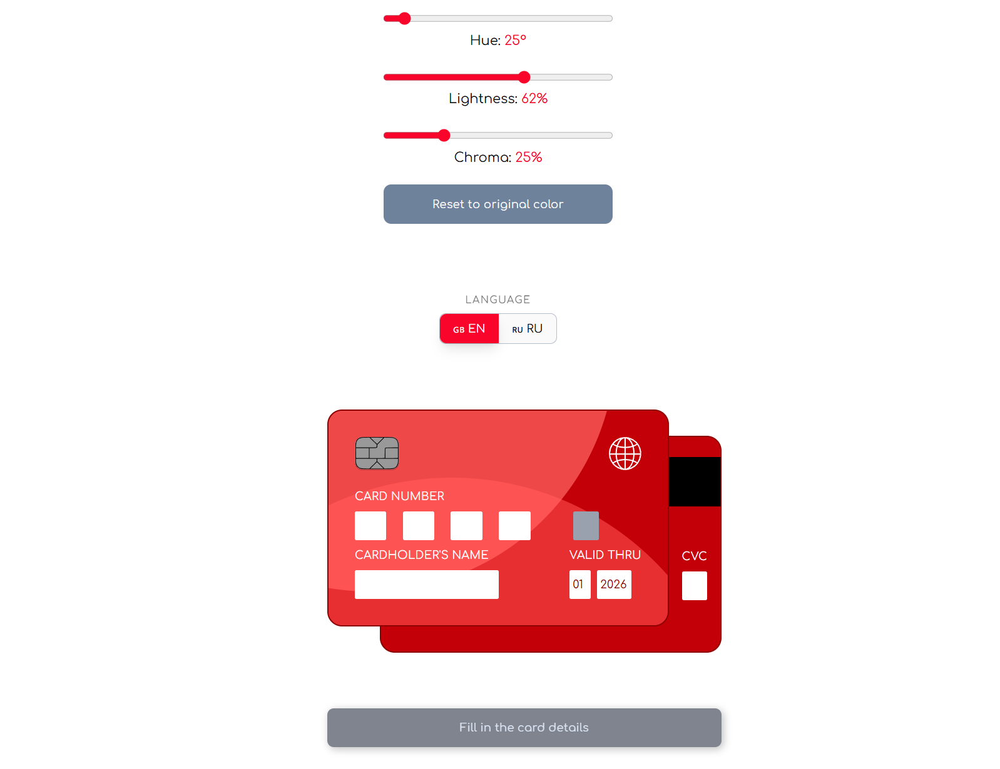

# 💳 Interactive 2D Bank Card Component

[Live Demo on Vercel](https://bank-card-2d.vercel.app) 🚀

---

A sleek, production-ready React component for credit card data entry. Focused on smooth UX, real-time validation, and modern styling.

### 🌟 Key Features

- **Dynamic Field Sync:** Real-time synchronization between form inputs and the card preview.
- **Smart Validation:** Powered by **TanStack Form** and **Zod** for robust, type-safe error handling.
- **Luhn Algorithm:** Automatic card number validation.
- **Adaptive UI:** Built with **Tailwind CSS** and **Shadcn UI** for a clean, accessible interface.
- **Responsive Design:** Works flawlessly on mobile and desktop devices.

### 🛠 Tech Stack

- **React 19** (Vite)
- **TanStack Form** (State management)
- **Zod** (Schema validation)
- **Tailwind CSS** (Styling)
- **Lucide React** (Icons)

### 🚀 Getting Started

1. Clone the repo: `git clone [url]`
2. Install dependencies: `npm install`
3. Run dev server: `npm run dev`

### 💡 Why this approach?

This component demonstrates how to handle complex form states without performance lags. By using **TanStack Form**, we ensure that only the necessary fields re-render, keeping the card preview animation buttery smooth.

### 🔃 Difference from 3D version

This is a lightweight 2D version of the animated bank card. If you are looking for the full 3D experience with OKLCH color customization, check out **[![3D version]](https://bankcard3d.vercel.app)**.

### 👤 Author

Developed with ❤️ by **Gaidysheff**
GitHub Profile

---

Licensed under the MIT License.
